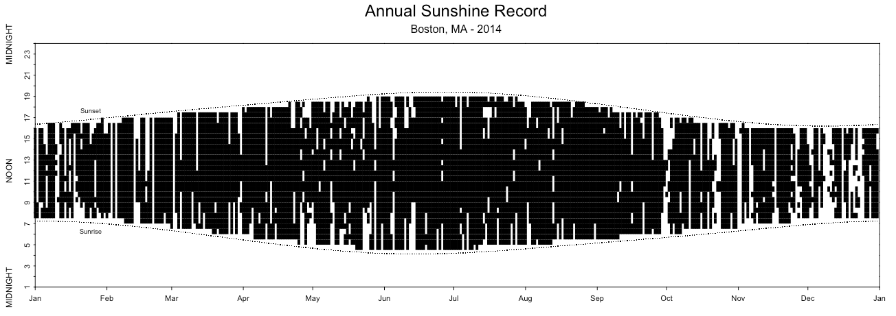

# Annual Sunshine Report

This R script attempts to recreate a graphic I found in Tufte's The Visual Display of Quantitative Information. It is an annual sunshine report of when, through the entire year of 1971, the sun was shining on London. (If you have a copy of The Visual Display, you can find it on page 165.) My version looks at Boston, MA for the year of 2014. You can see it below:

## Data Sources

I got my sunshine data from the [National Solar Radiation Data Base](http://rredc.nrel.gov/solar/old_data/nsrdb/), specifically using the Direct Normal Irradiance as a proxy for sunshine. You can set a more aggressive threshold on what counts as sunshine if you like, currently it sits at an irradiance > 0 is sunshine. I've included the data set I used in the repository.

I got the sunrise and sunset data from the [United States Navel Observatory](http://aa.usno.navy.mil/data/docs/RS_OneYear.php). That data set is also included in the repository.