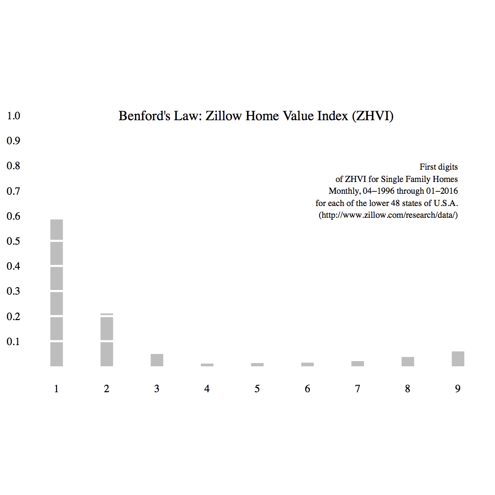

# Benford's Law

[Benford's Law](https://en.wikipedia.org/wiki/Benford%27s_law), or the first digit law, is a strange phenomena that occurs in the frequency distribution of the first digit of many (though not all) real-life sets of numerical data. You would think that if you took a random sample of data from, say, housing prices, and looked just at the first digit of these numbers, you would get an even distribution across the digits: ~1/9 would have the first digit '1', ~1/9 would have the first digit '2', etc. Except in many of these real-life sets of data, what you find is a logarithmic distribution: mostly they start with '1', some with '2', getting less and less logarithmically.

Here is an example of the distribution of distribution of the first digits of Zillow's Home Value Index for Single Family Homes:



## Data Source

Zillow provides various indexes for housing prices, though unfortunately does not provide (as far as I can tell) individual housing values or sale prices. I found a number of them [here](http://www.zillow.com/research/data/). I included the data set I used (downloaded from the website) in this repository.

## Requirements

The R script requires the following packages to run successfully:

```
ggplot2
ggthemes
```